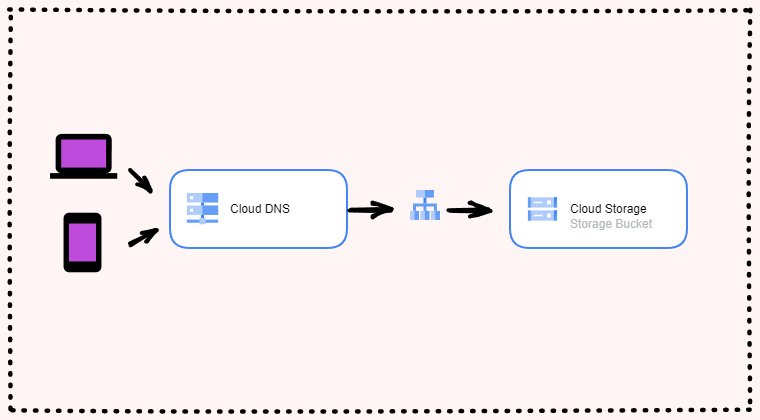

# Static Website by Google Cloud Storage

The goal of this task is create static website on GCP by Terraform and deploy application using CI/CD.

In this task:
- [x] Connect GCP with GitHub by generated key.
- [x] Create bucket with public access using Terraform Language - HCL.
- [x] Create template website localy and add to created bucket also using Terraform.
- [x] Deploy application using CI/CD on command 'push'. You can also change command to push resurces, for example 'pull request'.

When you create terrform files backend.tf, main.tf or provider.tf (as in this example) is important to format code. When you deploy application, unformatted code might create Error.

**Quick start**
1. Create repository, generate private key on GCP in IAM & Admin Service account and add to created repository.
2. Add ID project in variables.tf
3. Push the code and build infrastructure :smile:

**Screenshot**

If the code works, you should see:

The choice of Google Cloud Platform service to host a static website depends on the complexity of the project and what it will be used for.
Hosting a static site on Google Cloud Storage service is a simple and cost-effective way to host a site when you don't expect a lot of traffic, such as a simple website or CV.

1. After uploading static files to the bucket, such as HTML, CSS, the website will be available at the public URL in the created bucket: 
https://storage.googleapis.com/${bucket-name}/index.html. 

2. If you want a unique name, you can use a custom domain.
Cloud Storage does not support custom domains on their own with HTTPS, so you need to configure an SSL certificate attached to the load balancer system. An SSL certificate will increase the security of your site, and a load balancer will balance the amount of traffic on the available servers to ensure the availability of your site. You can turn on in GCC.

3. You can also link your domain by creating a CNAME record pointing to the address c.storgar.googleapis.com.
The name of the storage created and the domain name should be the same.

If you want to host a more complex site or application, App Engine or GKE would be a better choice. When you deploy an application on App Engine, you only focus on the code, not on VM configuration, scaling, load balancing - the service is automated.
Google Kubernetes Cluster is also a good idea, maybe not for a simple static website, but for an application - for sure! However, the implementation is a bit more complicated.

**Hosting Static Website on Google Cloud Storage**

