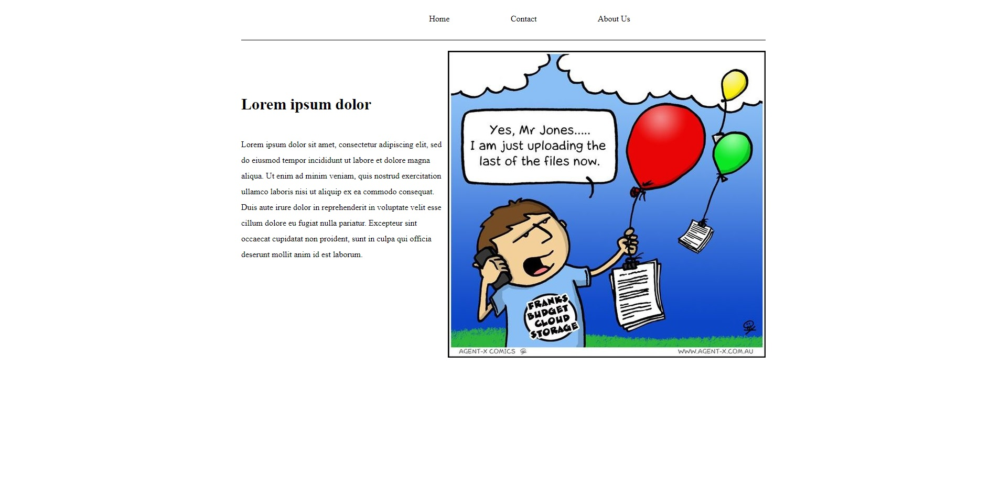

# Static Website by Google Cloud Storage

The goal of this task is create static website on GCP by Terraform and deploy application using CI/CD.

In this task:
- [x] Connect GCP with GitHub by generated key.
- [x] Create bucket with public access using Terraform Language - HCL.
- [x] Create template website localy and add to created bucket also using Terraform.
- [x] Deploy application using CI/CD on command 'push'. You can also change command to push resurces, for example 'pull request'.

When you create terrform files backend.tf, main.tf or provider.tf (as in this example) is important to format code. When you deploy application, unformatted code might create Error.

**Quick start**
1. Create repository, generate private key on GCP in IAM & Admin Service account and add to created repository.
2. Add ID project in variables.tf
3. Push the code and build infrastructure :smile:

**Screenshot**

If the code works, you should see:

